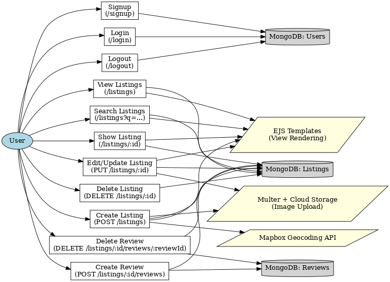

# 🏡 Wanderlust – Airbnb-like Travel Listing Platform

A **full-stack travel listing platform** inspired by Airbnb, built using **Node.js, Express, MongoDB, Mongoose, EJS, and Bootstrap**.  
This application enables users to **view, create, update, and review travel property listings**, with integrated **authentication, image uploads, and maps**.

---

## ✨ Features
- 🔑 **User Authentication** – Secure signup/login/logout with Passport.js  
- 🏡 **Listings CRUD** – Create, read, update, and delete property listings  
- 🔎 **Search Functionality** – Search listings by title or location  
- 📝 **Reviews System** – Add and delete reviews on listings  
- 🖼️ **Image Uploads** – Powered by Multer and Cloudinary  
- 🗺️ **Map Integration** – Mapbox API to display dynamic maps based on locations  
- 🎨 **Responsive UI** – Built with Bootstrap for a clean, user-friendly design  
- ⚙️ **Robust Backend** – Error handling, middleware, and RESTful APIs for scalability  

---

## 🛠️ Tech Stack
- **Backend**: Node.js, Express.js  
- **Database**: MongoDB, Mongoose  
- **Authentication**: Passport.js (Local Strategy)  
- **Templating Engine**: EJS  
- **Frontend Styling**: Bootstrap 5  
- **Cloud & APIs**: Multer, Cloudinary, Mapbox Geocoding API  

---

## 📂 Project Structure (Simplified)  
Major-Project/  
│── controllers/ # Business logic for listings, reviews, users  
│── models/ # Mongoose schemas (User, Listing, Review)  
│── routes/ # Express routes for users, listings, reviews  
│── views/ # EJS templates  
│── public/ # Static files (CSS, JS, images)  
│── utils/ # Helper utilities (wrapAsync, ExpressError)  
│── app.js # Main entry point  
│── package.json  
│── README.md  

## ⚙️ Installation & Setup

1. **Clone the repository**
   ```bash  
   git clone https://github.com/Kaushal-Kushwaha-0007/Major-Project.git

3. **Navigate into the project folder**
   ```bash
   cd Major-Project  

5. **Install dependencies**
   ```bash
   npm install

7. **Set up environment variables**   
   Create a .env file in the root directory and add the following:
   ```env
   MAP_TOKEN=your_mapbox_token  
   CLOUDINARY_CLOUD_NAME=xxxx  
   CLOUDINARY_KEY=xxxx  
   CLOUDINARY_SECRET=xxxx  

9. **Run the server**
    ```bash
   npm start  

11. **Access the app**  
Open your browser and go to: http://localhost:3000  


# 🚀 Project Flow

## 📊 Flowchart



---

## 🌐 Flow Explanation

### **1. User Interactions**
- 👤 A **User** interacts with the system through routes like `/signup`, `/login`, `/listings`, etc.  
- These requests pass through **Routes → Controllers → Database/Services**, and finally respond with **EJS-rendered views**.

---

### **2. 🔑 Authentication (Users)**
- **Signup (`/signup`)** → `usersController.signup`  
  - ✨ Creates new user → Stored in **MongoDB (Users)**  
  - ✅ Automatically logs in and redirects to `/listings`
- **Login (`/login`)** → Passport Local Strategy  
  - 🔍 Verifies credentials with **MongoDB (Users)**  
  - 📂 Starts a session and redirects to `/listings`
- **Logout (`/logout`)** → `usersController.logout`  
  - 🚪 Ends session and redirects to listings page

---

### **3. 🏡 Listings (Core CRUD)**
- **View Listings (`GET /listings`)** → `listingsController.index`  
  - 📥 Fetches all listings from **MongoDB (Listings)**  
  - 🎨 Renders with **EJS**
- **Search Listings (`GET /listings?q=...`)**  
  - 🔎 Queries by `title` or `location`  
  - 📋 Returns filtered results
- **Create Listing (`POST /listings`)** → `listingsController.createListing`  
  - 🖼️ Uses **Multer** to upload images → stored in Cloud  
  - 🗺️ Uses **Mapbox Geocoding API** to convert location → coordinates  
  - 💾 Saves new listing in **MongoDB (Listings)**  
  - ↪️ Redirects to `/listings`
- **Show Listing (`GET /listings/:id`)** → `listingsController.showListing`  
  - 📌 Fetches listing + reviews + owner (via `.populate`)  
  - 🎨 Renders with **EJS**
- **Update Listing (`PUT /listings/:id`)** → `listingsController.updateListing`  
  - 📤 Updates MongoDB data  
  - 🖼️ Handles new image (via **Multer**) if provided  
- **Delete Listing (`DELETE /listings/:id`)** → `listingsController.destroyListing`  
  - 🗑️ Deletes listing from **MongoDB**

---

### **4. 📝 Reviews (Nested in Listings)**
- **Create Review (`POST /listings/:id/reviews`)** → `reviewsController.createReview`  
  - 🆕 Creates new review in **MongoDB (Reviews)**  
  - 🔗 Links review ID to listing’s `reviews[]` array  
  - ↪️ Redirects back to listing page
- **Delete Review (`DELETE /listings/:id/reviews/:reviewId`)** → `reviewsController.destroyReview`  
  - ❌ Removes review from **MongoDB (Reviews)**  
  - 🔗 Unlinks from the associated listing

---

### **5. 🛡️ Middleware**
- 🔒 `isLoggedIn` → Only logged-in users can create/update/delete  
- 👑 `isOwner` → Only the listing owner can edit/delete  
- ✍️ `isReviewAuthor` → Only the review author can delete  
- ✅ `validateListing` & `validateReview` → Input validation (Joi)

---

### **6. 🌍 External Services**
- 🗺️ **Mapbox Geocoding API** → Converts location text → longitude & latitude  
- 🖼️ **Multer + Cloud Storage** → Handles image uploads for listings  
- 🎨 **EJS Templates** → Renders all dynamic views

## 📜 License  
This project is licensed under the MIT License.
